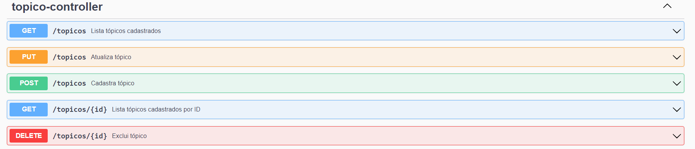
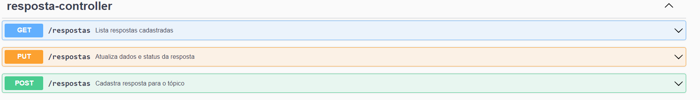
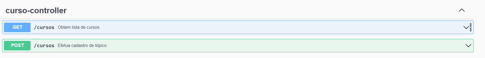
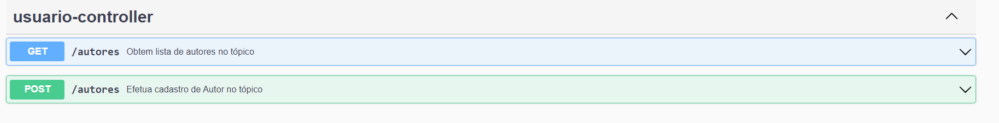

# FÓRUM DA ALURA - SIMULAÇÃO

## Descrição:
CRUD simples que simula fórum da Alura.Por meio de tópico de dúvida e respostas dos usuários ao mesmo.
Desafio proposto nos cursos conforme abaixo:

🔗 https://cursos.alura.com.br/course/api-rest-kotlin-spring-boot-camada-web
🔗 https://cursos.alura.com.br/course/api-rest-kotlin-spring-boot-camada-persistencia

##Funcionalidades:
Tópico: Postagem dúvidas de um determinado usuário(autor) sobre um curso;
Respostas:Postagem de respostas a determinado tópico de um usuario e curso;
Usuario: Usuários cadastrados, uma vez que ainda não é neste projeto capturado o usuário do sistema logado;
Curso: Cursos cadastrados no sistema para postagem de tópicos.
Status do Topico: O topico pode assumir os seguintes status:
* NÃO RESPONDIDO  - Estado inicial do tópico.Criado porem sem resposta atribuidas.
* NÃO SOLUCIONADO - Tópico com postagem atribuidas que não seja a solução.
* SOLUCIONADO - Tópico solucuinado.
* FECHADO - Tópico já solucionado , recebe uma atualização de fechamento.

##Resquisitos Funcionais:
* Para cadastro de Autor(usuário) primeiro é necessário efetuar o cadastro de curso.
* Para cadastro de um tópico é necessario antes efetuar o cadastro do curso e autor(usuário).
* Não permite efetuar atualização de resposta para tópico no status NÃO Respondido.
* Não é permitido atualizar respostas para tópicos sem respostas atribuídas.
* Tópicos já solucionados quando atualizados apenas são alterados para o status fechado.
* Após o fechamento do Tópico não é permitido nenhuma alteração no mesmo.

## Conceitos Aplicados neste projeto:
- Padrão POM;
- Paginação e ordenação
- Data Transfer Objects
- Migrations com Flyway;
- Tratamento de erros;
- Cache;
- Boas práticas do REST;
- Entidades JPA.

# 📥  Softwares utilizados:
- Base de Dados: H2
- Spring BOOT MAVEN KOTLIN: versão 3.2.2
- DATA JPA: 
- Hibernate:
- SWAGGER:

# Como executar do Projeto:
- 1) Efetuar clone do repositório;
- 2) Baixar depêndencias contidas no maven do projeto;

# Estrutura do projeto:
- /Controller-> Controllers de cada parte do CRUD do forum (Resposta,Topico,Curso e Autor)
- /DTOS-> Transferência de dados entre camadas da aplicação
- /Exception-> Excessões da aplicação
- /Mapper-> Classes de Conversão de dados 
- /Model-> Modelos de dados utilizados no Fórum
- /Repository-> Classes repositorios da aplicação
- /Service-> Classes de serviço do CRUD na aplicação
- /Resource:
  *application.yml -> Configurações adicionais do projeto
- *db.migrations -> Scripts SQL de migração para criação da base de dados
- *Swagger.mhtml -> Documentação da API

## Oportunidades de melhoria:
- Geração de massa automatizada;
- Configuração de esteira CI/CD;
- Quantidade de timeout do projeto (diminuição);

## Endpoints:
- Tópicos:

- Respostas:

- Cursos:

- Usuários:

## Links Úteis:
Console da Base de Dados H2
🔗http://localhost:8080/h2-console/

Documentação Swagger
🔗 http://localhost:8080/swagger-ui/index.html

## Observações e m elhorias:
_ Este projeto não possui a camada de frontend visto que o foco era a aplicação da aprendizagem dos conceitos de API REST, Spring BOOT e DATA JPA.
_ Ainda não foi implementado a captura de usuário do sistema , nem token de segurança.
_ Não foi feito diagrama de classes , bem como o DER do mesmo.
_ Não foi implementado testes UNITARIOS/FUNCIONAIS automatizados.

